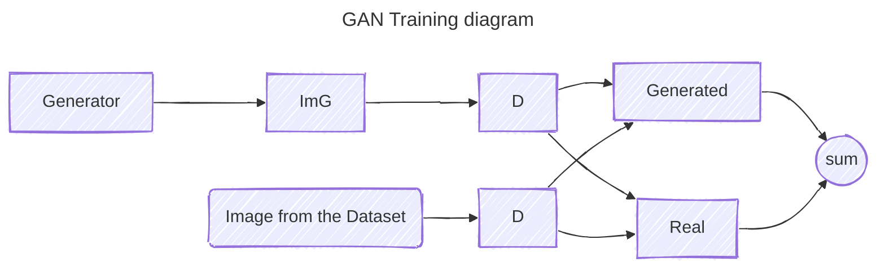

# Train Compare Adjust
> I don't know it until I code it myself

A repo for all of my AI and Machine Learning exercises. 


## Areas of interest:

- NLP[^nlp]
- GANs and controlling their non-convex[^non-convex]

[^non-convex]: In non-convex functions there are multiple local minima, making them hard to find a global optimum for. 

[^nlp]: nlp

## University Final Project




## An easier time for a future me

For easier comparison between models and technics, I'd like to use a config for every model I make, that can be used to reference the training parameters and compare its results. By making it a file, I should be able to set it up so the parser would train multiple models one after the other or in parallel.

Big words. So let's the describe the behavior I'd like to accomplish once I finish with the models I want to train at least once.

```mermaid


```